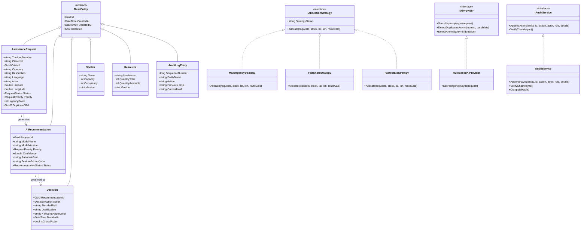

# AEGIS Class Diagram (Clean Architecture & GoF Patterns)

```mermaid
classDiagram
    class BaseEntity {
        <<abstract>>
        +Guid Id
        +DateTime CreatedAt
        +DateTime? UpdatedAt
        +bool IsDeleted
    }

    class AssistanceRequest {
        +string TrackingNumber
        +string CitizenId
        +Guid CrisisId
        +string Category
        +string Description
        +string Language
        +string Area
        +double Latitude
        +double Longitude
        +RequestStatus Status
        +RequestPriority Priority
        +int UrgencyScore
        +Guid? DuplicateOfId
    }

    class AiRecommendation {
        +Guid RequestId
        +string ModelName
        +string ModelVersion
        +RequestPriority Priority
        +double Confidence
        +string RationaleJson
        +string FeatureScoresJson
        +RecommendationStatus Status
    }

    class Decision {
        +Guid RecommendationId
        +DecisionAction Action
        +string DecidedById
        +string Justification
        +string? SecondApproverId
        +DateTime DecidedAt
        +bool IsCriticalAction
    }

    class Shelter {
        +string Name
        +int Capacity
        +int Occupancy
        +uint Version
    }

    class Resource {
        +string ItemName
        +int QuantityTotal
        +int QuantityAvailable
        +uint Version
    }

    class AuditLogEntry {
        +long SequenceNumber
        +string EntityName
        +string Action
        +string PreviousHash
        +string CurrentHash
    }

    class IAllocationStrategy {
        <<interface>>
        +string StrategyName
        +Allocate(requests, stock, lat, lon, routeCalc)
    }

    class MaxUrgencyStrategy {
        +Allocate(requests, stock, lat, lon, routeCalc)
    }

    class FairShareStrategy {
        +Allocate(requests, stock, lat, lon, routeCalc)
    }

    class FastestEtaStrategy {
        +Allocate(requests, stock, lat, lon, routeCalc)
    }

    class IAiProvider {
        <<interface>>
        +ScoreUrgencyAsync(request)
        +DetectDuplicatesAsync(request, candidate)
        +DetectAnomalyAsync(donation)
    }

    class RuleBasedAiProvider {
        +ScoreUrgencyAsync(request)
    }

    class IAuditService {
        <<interface>>
        +AppendAsync(entity, id, action, actor, role, details)
        +VerifyChainAsync()
    }

    class AuditService {
        +AppendAsync(entity, id, action, actor, role, details)
        +VerifyChainAsync()
        +ComputeHash()$
    }

    BaseEntity <|-- AssistanceRequest
    BaseEntity <|-- AiRecommendation
    BaseEntity <|-- Decision
    BaseEntity <|-- Shelter
    BaseEntity <|-- Resource
    BaseEntity <|-- AuditLogEntry

    AssistanceRequest "1" --> "*" AiRecommendation : generates
    AiRecommendation "1" --> "*" Decision : governed by
    IAllocationStrategy <|.. MaxUrgencyStrategy
    IAllocationStrategy <|.. FairShareStrategy
    IAllocationStrategy <|.. FastestEtaStrategy
    IAiProvider <|.. RuleBasedAiProvider
    IAuditService <|.. AuditService
```
