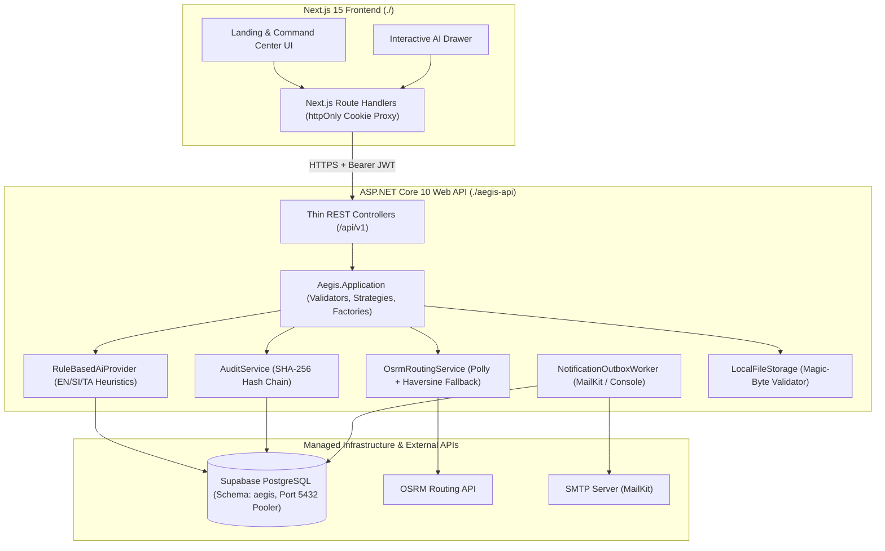

# AEGIS Component Diagram

```mermaid
flowchart TB
    subgraph Client["Next.js 15 Frontend (./)"]
        UI["Landing & Command Center UI"]
        Drawer["Interactive AI Drawer"]
        Proxy["Next.js Route Handlers (httpOnly Cookie Proxy)"]
    end

    subgraph Backend["ASP.NET Core 10 Web API (./aegis-api)"]
        Controllers["Thin REST Controllers (/api/v1)"]
        AppLayer["Aegis.Application (Validators, Strategies, Factories)"]
        AiEngine["RuleBasedAiProvider (EN/SI/TA Heuristics)"]
        AuditSvc["AuditService (SHA-256 Hash Chain)"]
        RoutingSvc["OsrmRoutingService (Polly + Haversine Fallback)"]
        OutboxWorker["NotificationOutboxWorker (MailKit / Console)"]
        FileStore["LocalFileStorage (Magic-Byte Validator)"]
    end

    subgraph External["Managed Infrastructure & External APIs"]
        Supabase[("Supabase PostgreSQL (Schema: aegis, Port 5432 Pooler)")]
        OSRM["OSRM Routing API"]
        SMTP["SMTP Server (MailKit)"]
    end

    UI --> Proxy
    Drawer --> Proxy
    Proxy -->|HTTPS + Bearer JWT| Controllers
    Controllers --> AppLayer
    AppLayer --> AiEngine
    AppLayer --> AuditSvc
    AppLayer --> RoutingSvc
    AppLayer --> FileStore
    AiEngine --> Supabase
    AuditSvc --> Supabase
    OutboxWorker --> Supabase
    OutboxWorker --> SMTP
    RoutingSvc --> OSRM
```
