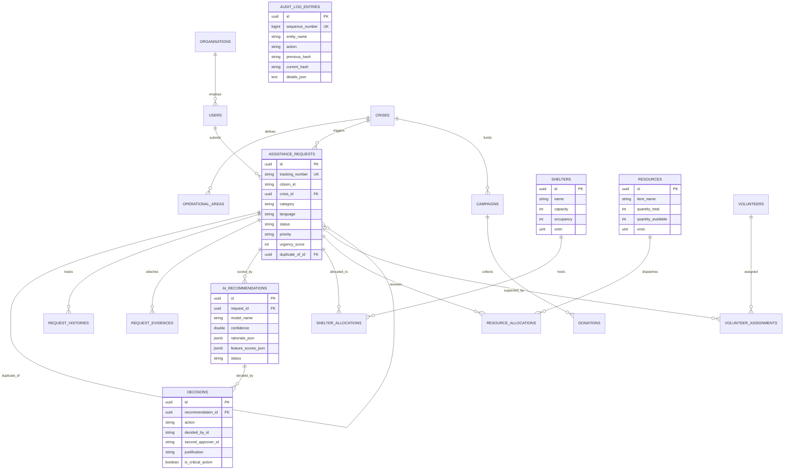

# AEGIS Entity-Relationship (ER) Diagram (Schema: `aegis`)

```mermaid
erDiagram
    ORGANISATIONS ||--o{ USERS : employs
    CRISES ||--o{ OPERATIONAL_AREAS : defines
    CRISES ||--o{ ASSISTANCE_REQUESTS : triggers
    CRISES ||--o{ CAMPAIGNS : funds
    USERS ||--o{ ASSISTANCE_REQUESTS : submits
    ASSISTANCE_REQUESTS ||--o{ ASSISTANCE_REQUESTS : duplicate_of
    ASSISTANCE_REQUESTS ||--o{ REQUEST_HISTORIES : tracks
    ASSISTANCE_REQUESTS ||--o{ REQUEST_EVIDENCES : attaches
    ASSISTANCE_REQUESTS ||--o{ AI_RECOMMENDATIONS : scored_by
    AI_RECOMMENDATIONS ||--o{ DECISIONS : decided_by
    SHELTERS ||--o{ SHELTER_ALLOCATIONS : hosts
    ASSISTANCE_REQUESTS ||--o{ SHELTER_ALLOCATIONS : allocated_to
    RESOURCES ||--o{ RESOURCE_ALLOCATIONS : dispatches
    ASSISTANCE_REQUESTS ||--o{ RESOURCE_ALLOCATIONS : receives
    VOLUNTEERS ||--o{ VOLUNTEER_ASSIGNMENTS : assigned
    ASSISTANCE_REQUESTS ||--o{ VOLUNTEER_ASSIGNMENTS : supported_by
    CAMPAIGNS ||--o{ DONATIONS : collects

    ASSISTANCE_REQUESTS {
        uuid id PK
        string tracking_number UK
        string citizen_id
        uuid crisis_id FK
        string category
        string language
        string status
        string priority
        int urgency_score
        uuid duplicate_of_id FK
    }

    AI_RECOMMENDATIONS {
        uuid id PK
        uuid request_id FK
        string model_name
        double confidence
        jsonb rationale_json
        jsonb feature_scores_json
        string status
    }

    DECISIONS {
        uuid id PK
        uuid recommendation_id FK
        string action
        string decided_by_id
        string second_approver_id
        string justification
        boolean is_critical_action
    }

    SHELTERS {
        uuid id PK
        string name
        int capacity
        int occupancy
        uint xmin
    }

    RESOURCES {
        uuid id PK
        string item_name
        int quantity_total
        int quantity_available
        uint xmin
    }

    AUDIT_LOG_ENTRIES {
        uuid id PK
        bigint sequence_number UK
        string entity_name
        string action
        string previous_hash
        string current_hash
        text details_json
    }
```
