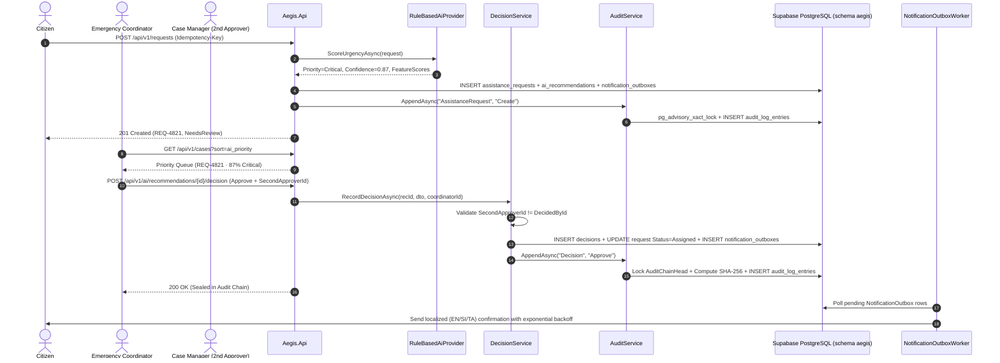

# AEGIS Sequence Diagram — AI-Assisted Human Decision Workflow

```mermaid
sequenceDiagram
    autonumber
    actor Citizen
    actor Coordinator as Emergency Coordinator
    actor SecondApprover as Case Manager (2nd Approver)
    participant API as Aegis.Api
    participant AI as RuleBasedAiProvider
    participant DecisionSvc as DecisionService
    participant Audit as AuditService
    participant DB as Supabase PostgreSQL (schema aegis)
    participant Outbox as NotificationOutboxWorker

    Citizen->>API: POST /api/v1/requests (Idempotency-Key)
    API->>AI: ScoreUrgencyAsync(request)
    AI-->>API: Priority=Critical, Confidence=0.87, FeatureScores
    API->>DB: INSERT assistance_requests + ai_recommendations + notification_outboxes
    API->>Audit: AppendAsync("AssistanceRequest", "Create")
    Audit->>DB: pg_advisory_xact_lock + INSERT audit_log_entries
    API-->>Citizen: 201 Created (REQ-4821, NeedsReview)

    Coordinator->>API: GET /api/v1/cases?sort=ai_priority
    API-->>Coordinator: Priority Queue (REQ-4821 · 87% Critical)

    Coordinator->>API: POST /api/v1/ai/recommendations/{id}/decision (Approve + SecondApproverId)
    API->>DecisionSvc: RecordDecisionAsync(recId, dto, coordinatorId)
    DecisionSvc->>DecisionSvc: Validate SecondApproverId != DecidedById
    DecisionSvc->>DB: INSERT decisions + UPDATE request Status=Assigned + INSERT notification_outboxes
    DecisionSvc->>Audit: AppendAsync("Decision", "Approve")
    Audit->>DB: Lock AuditChainHead + Compute SHA-256 + INSERT audit_log_entries
    API-->>Coordinator: 200 OK (Sealed in Audit Chain)

    Outbox->>DB: Poll pending NotificationOutbox rows
    Outbox->>Citizen: Send localized (EN/SI/TA) confirmation with exponential backoff
```
