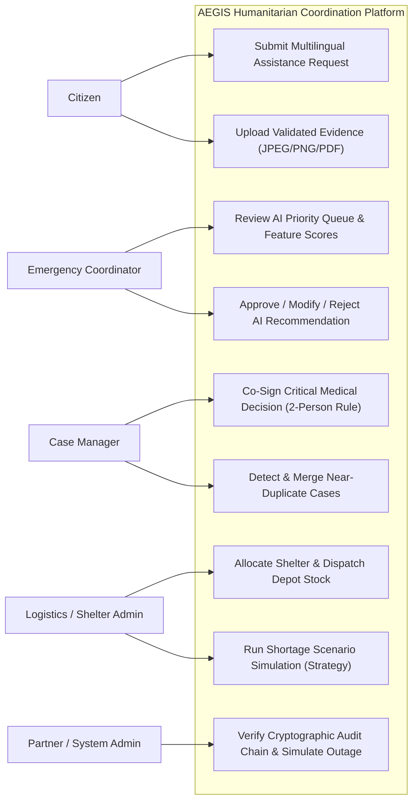

# AEGIS Use Case Diagram

```mermaid
flowchart LR
    Citizen["Citizen"]
    Coord["Emergency Coordinator"]
    CaseMgr["Case Manager"]
    Logistics["Logistics / Shelter Admin"]
    Auditor["Partner / System Admin"]

    subgraph AEGIS["AEGIS Humanitarian Coordination Platform"]
        UC1["Submit Multilingual Assistance Request"]
        UC2["Upload Validated Evidence (JPEG/PNG/PDF)"]
        UC3["Review AI Priority Queue & Feature Scores"]
        UC4["Approve / Modify / Reject AI Recommendation"]
        UC5["Co-Sign Critical Medical Decision (2-Person Rule)"]
        UC6["Detect & Merge Near-Duplicate Cases"]
        UC7["Allocate Shelter & Dispatch Depot Stock"]
        UC8["Run Shortage Scenario Simulation (Strategy)"]
        UC9["Verify Cryptographic Audit Chain & Simulate Outage"]
    end

    Citizen --> UC1
    Citizen --> UC2
    Coord --> UC3
    Coord --> UC4
    CaseMgr --> UC5
    CaseMgr --> UC6
    Logistics --> UC7
    Logistics --> UC8
    Auditor --> UC9
```
